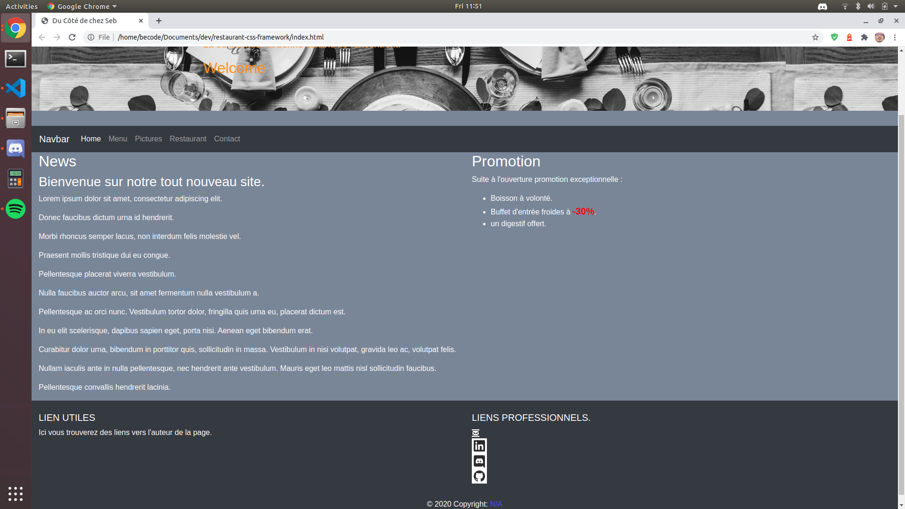
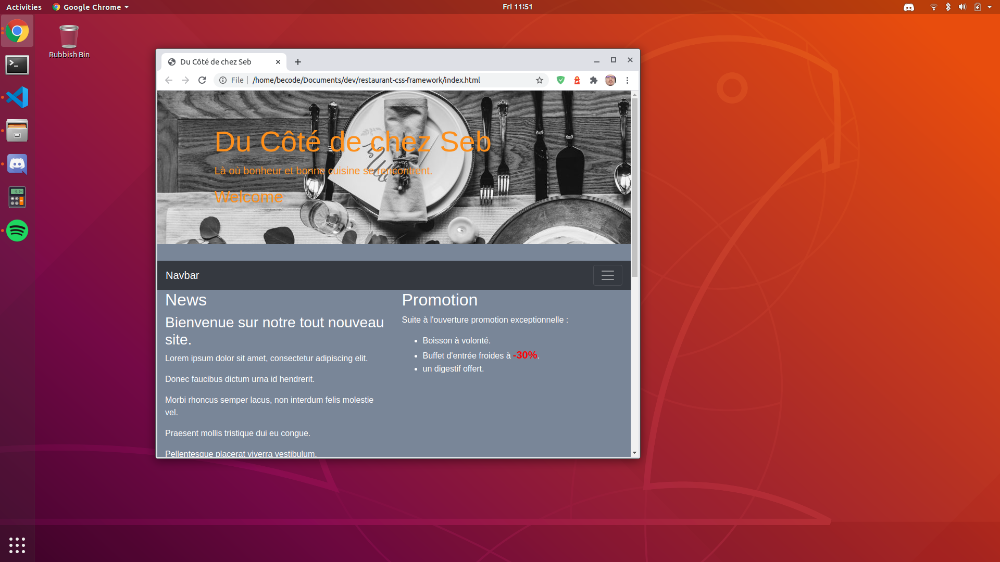
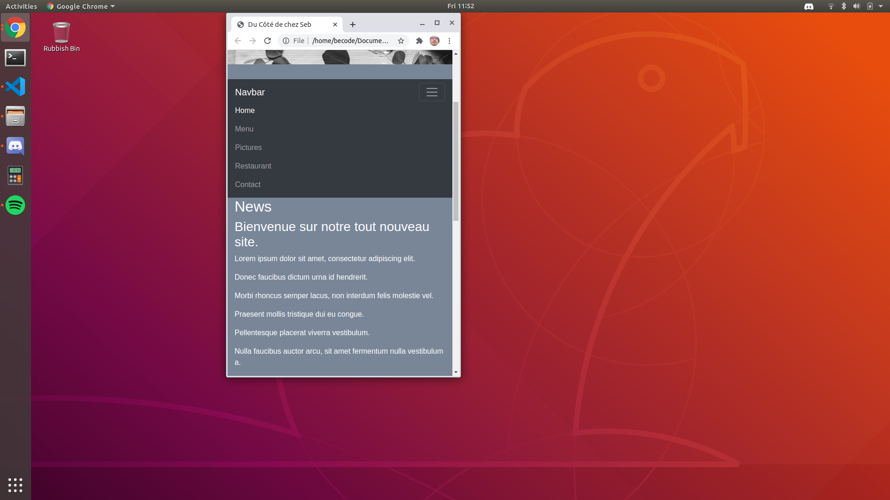

# restaurant-css-framework

## Introduction

Vous trouverez ici un site de restaurant réalisé via framework.  

Il s'agit d'un excercice réalisé durant la formation chez BeCode de Junior Web Dev.  

## Langages utilisés

+ HTML5, CSS3  
+ Bootstrap 4
+ JS

## Responsive

Implémenté via Bootstrap 4  

## Team

Réalisation Solo  

## Liens vers la page  

[Içi](https://meuniers.github.io/restaurant-css-framework/)  

## Progression

Début : 25/06/2020

v1.0 : 26/06/2020  

## Historique

+ 25/06/2020 09h30 : création du readme, initialisation du repo, des dossiers et des fichiers basiques.
+ 25/06/2020 10h30 : Exosquelette HTML5 des 5 pages du site (footer/header/navbar).  
+ 25/06/2020 12h00 : Index.html mise en place, correction mineures sur le footer et la navbar.
+ 25/06/2020 14h55 : Carte mise en place en Lorem ipsum.
+ 25/06/2020 16h30 : Gallerie d'images squelette mis en place, inclusion de JS.
+ 26/06/2020 10h20 : Correction JS et HTML5 dans la page pict.html, Formulaire de contact implémenté, page franshise implémentée, Exosquelette terminé.
+ 26/06/2020 11h55 : Ajout des assets, CSS, gallerie image. Push v1.0
+ 26/06/2020 14h20 : Correction pour validation w3c. => v1.1

## Poste occupé durant la Réalisation

+ Junior Web Dev chez Becode

## Screenshots

## Credits

Photo Source :
+ [Lifeofpix](https://www.lifeofpix.com/)